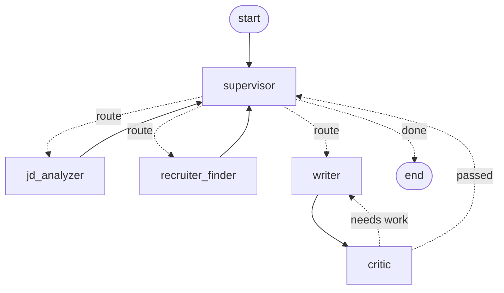

# ai-job-outreach-agent

A multi-agent AI assistant for job outreach. A Chrome extension plus a
**LangGraph** backend that, starting from a LinkedIn job page, analyzes the job
description, finds a recruiter contact, drafts a tailored outreach email through
a write-and-critique loop, and sends it via Gmail.

The project is a focused, end-to-end demonstration of multi-agent orchestration:
hierarchical delegation, a ReAct tool-use loop, and a self-reflection loop —
each one load-bearing, not decorative.

## What it does

1. You open a LinkedIn job posting; the extension sidebar reads the page.
2. You paste your resume once (stored locally in the browser).
3. **Generate** runs the agent graph: it parses the posting, hunts down a
   recruiter contact, drafts an email, and revises it against a quality rubric.
4. You can ask for changes in plain language ("make it shorter") — follow-up
   turns resume the same job context and only re-run what's needed.
5. **Send** delivers it through your Gmail account.

## Architecture

The backend is a single LangGraph `StateGraph`. Think of it as a shared
blackboard (`OutreachState`) plus a set of nodes that transform it — not a
fixed pipeline.



| Node | Role | Pattern |
|------|------|---------|
| **supervisor** | Re-reads state on every visit and dispatches to a specialist. Not a fixed order — a follow-up request skips steps already done. | hierarchical delegation |
| **jd_analyzer** | Extracts structured job info from the noisy posting. A plain worker, deliberately *not* an agent. | — |
| **recruiter_finder** | Finds a recruiter contact via a hand-written reason→act→observe loop over a web-search tool. | **ReAct** |
| **writer** | Drafts the email; dual-mode (generate / revise). | — |
| **critic** | Scores the draft against an explicit rubric and feeds revisions back to the writer. | **self-reflection** |

Sending email is a plain operation with no reasoning, so it is a standalone
`/send` endpoint — deliberately *not* forced into the agent graph.

### Why a graph (and not a function)

- **Real conditional branching** — an email already in the posting skips the
  search; a follow-up request skips analysis.
- **Two real cycles** — the recruiter search loop and the writer↔critic
  reflection loop. Cycles are exactly what LangGraph adds over a plain chain.
- **Bounded loops** — `MAX_SEARCHES` and `MAX_REVISIONS` guard both; on
  exhaustion each degrades gracefully instead of spinning.
- **Resumable state** — a `MemorySaver` checkpointer keyed by `thread_id` lets
  follow-up turns continue the same job context. No database.

## Tech stack

- **Backend**: Python, LangGraph (`StateGraph` + checkpointer), FastAPI, LangSmith
- **LLM**: OpenAI (structured output via Pydantic schemas)
- **Web search**: Tavily
- **Frontend**: Chrome extension (Manifest V3)

## Setup — backend

```bash
cd backend
python -m venv .venv && source .venv/bin/activate
pip install -r requirements.txt
cp ../.env.example ../.env      # then fill in the keys
uvicorn app.main:app --reload --port 8000
```

Required keys in `.env`: `OPENAI_API_KEY`, `TAVILY_API_KEY`. Set
`LANGSMITH_API_KEY` (and `LANGSMITH_TRACING=true`) to get full traces in
LangSmith — no code changes needed.

## Setup — Chrome extension

1. Create an OAuth 2.0 **Chrome Extension** client in the Google Cloud Console,
   enable the Gmail API, and add the `gmail.send` scope.
2. Put the client id into `frontend/manifest.json` (`oauth2.client_id`).
3. Chrome → Extensions → enable Developer mode → **Load unpacked** → select
   `frontend/`.
4. Open a LinkedIn job posting; the sidebar appears on the right.

## Tests

The full backend is covered by mock-based tests that run **without API keys**.
A small fake-LLM scenario harness queues canned structured responses per
Pydantic schema and per ReAct iteration, so every node, the full graph (including
the JD-email shortcut, the reflection loop, and multi-turn resume), and the
FastAPI endpoints all run end to end against fakes.

```bash
cd backend
pip install -r requirements-dev.txt
pytest
```

## Eval

`eval/run_eval.py` runs the graph twice on a sample resume + posting — with the
reflection loop off (`MAX_REVISIONS=0`) and on — and prints the critic's rubric
scores for each, so the value of the self-reflection loop is measurable.

```bash
cd eval && python run_eval.py
```

## Layout

```
backend/app/graph/   LangGraph system — state, graph wiring, nodes, prompts
backend/app/tools/   web search + Gmail send
backend/app/main.py  FastAPI server (/compose, /send)
frontend/            Chrome extension (Manifest V3)
eval/                reflection-loop eval + sample data
```
